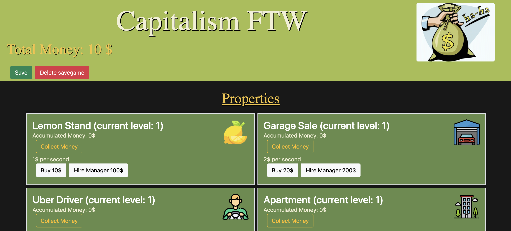
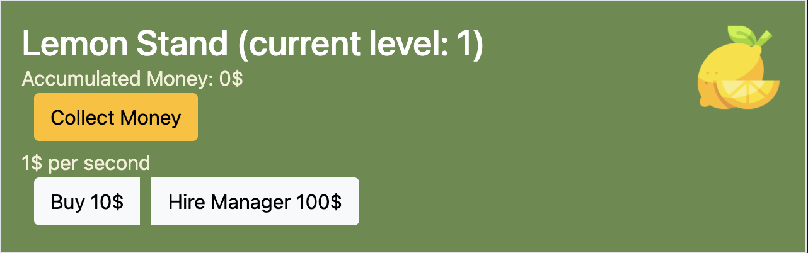
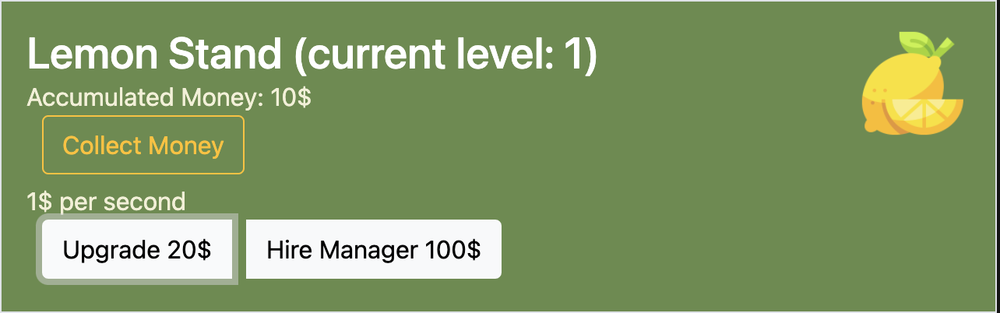

# Capitalism FTW!
## Introduction

Welcome to my Idle Game Project - Capitalism FTW!

Have you ever wanted to take over the world with your businesses like Bill Gates? Well you can with Capitalism FTW!

## Environment

This is a browser game made with the big 3 (With a little help from Bootstrap)
- JavaScript
- HTML
- CSS

The reasons for choosing this stack is mainly because of the the simple integration onto browser. I am also very familiar and comfortable with JavaScript. 
Due to time constraints, it is front-end based. I would have liked to incorporate a full stack with a back end and database. This is so the user could input their own data while also saving data to a database. It would be great for idleing.

### Setup

Setup is relatively simple. All you need to do is:
- Fork and clone this repository
- Open this with your code editor of choice
- Right click on the `index.html` and choose `copy path`
- Paste into the browser of your choice and get started on becoming a rich

### Simple gameplay

You start with $10 (LUCKY YOU!). From there you can buy your very own lemon stand and sit back and watch the money being made. Make sure to click the `Collect Money` button to add to your `Total Money`.

After buying your property. You can `Upgrade` your property. Make sure you have enough `Total Money` though.

Once you have enough `Total Money`, you can Hire your very own manager to add your money directly to your `Total Money`.

No more `Collect Money` button for you!

## Idle

The main part of this game is in the `idle.js` file. Here you can find how the main game loop works and also how the property constructor works.
Speaking of the property constructor, if you would like to create your own properties, this is done in the `main.js` file. You will need to add (property name, level, money per second, cost, manager cost, image src) when creating an instance.

## Future Plans

I would like to clean up the property constructor and put it in it's own file, so the idle.js file is only for the main game loop and game data.

Find a way to save on exit in a user friendly way, while also onclick for the save button (it currenlty only saves the gameData, and not the individual property data)

I would also like to style it more, so it looks more "cartoon-y" and fun. For example, less hard edges.

### Thanks for taking a look!

Icons used from <a href="https://www.flaticon.com/" title="Flaticon">www.flaticon.com</a>
